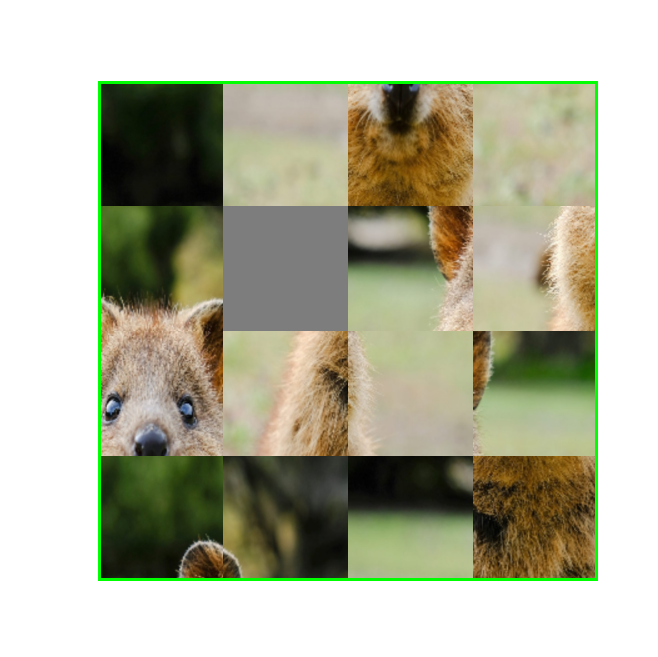
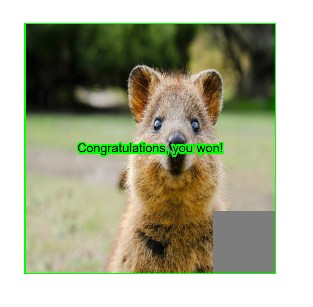

# photo_puzzle

This is a puzzle game created in p5.js. The goal is to slide the tiles, until the image is restored.
The user is presented with an image like this one:

A photo is broken up into a series of rectangles. The rectangles are shuffled. The goal for the user is to
reorder the rectangles by clicking and sliding them into the correct position. If done correctly, the original
image is visible again. The resulting image should look similar to this one:

When the image is successfully restored a text message pops up informing the user that they were successful.

NOTE: Sometimes the image does not load. Simply refresh the screen until it does load correctly. I will look into this later.
